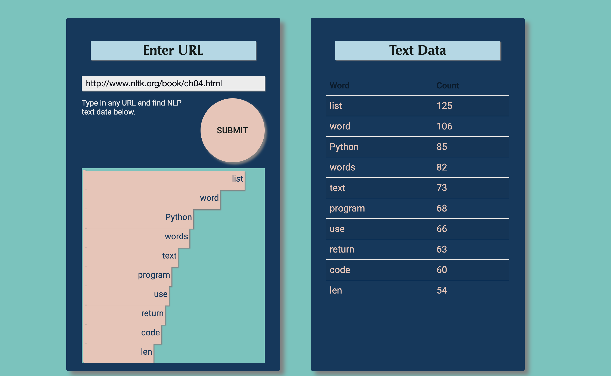

# LanguageProcessing

A quick minimal implementation of NLP that allows one to grabs a URL and count the ten most frequent words. This is a work in process. I'll be adding more NLP functionality, refining the focus of text dataset, and cleaning up interface in the near future. 

### 🏠 [Demo](https://nlp-nltk-pro.herokuapp.com/)

Tools used: Python, Redis, PostgreSQL, Angular Bootstrap, D3.
